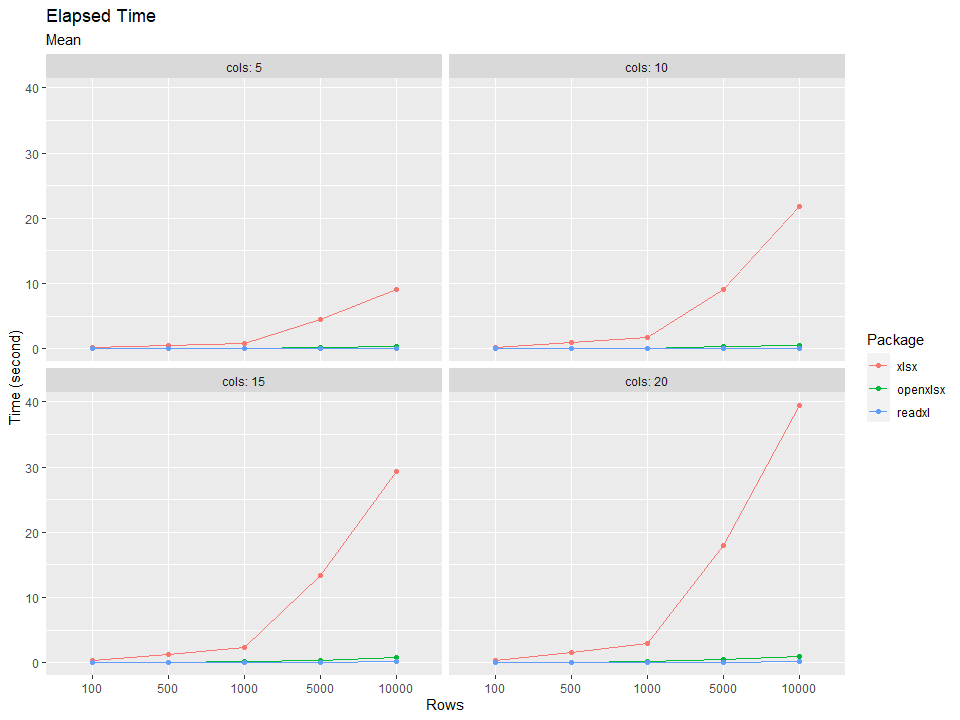

# Working with Excel files in R: A Journey to Find the Fastest Importer

*Disclaimer: this is the iterated version of my old Linkedin [post](https://www.linkedin.com/pulse/benchmarking-xlsx-openxlsx-readxl-package-r-arif-setyawan/). I changed some codes and parameters in comparison to the old version.*


## Table of Content

  * [Background](#background)
  * [Finding available tools](#finding-available-tools)
  * [Benchmarking](#benchmarking)
    + [Data preparation](#data-preparation)
  * [Benchmarking process](#benchmarking-process)
    + [Summarizing](#summarizing)
    + [Visualization](#visualization)
  * [Result](#result)
    + [Table view](#table-view)
    + [Chart view](#chart-view)
  * [Final thoughts](#final-thoughts)
  * [Reference](#reference)

---

## Background

In my previous and current projects, I was working with Excel files. One of the tasks was to import an Excel file to another software, as in my case, it was R. At a glance, I know the `xlsx` package on R, and I thought it would be easy and quick to finish the task. Until I figured out that this simple importing task could be time-consuming. It is done quickly for small-sized data Excel files, yet not for larger ones. This problem led me to the curiosity of what is the fastest R package to import Excel files.

There are a few reasons I could not convert the Excel files to CSV files. One of the reasons is CSV cannot preserve long decimal values while I work decimals most of the time. I realize that importing CSV files is much faster (`fread()` in the `data.table` package is the best in my opinion) and less memory-consuming than Excel, but in this case, I need to work with Excels.

## Finding available tools

I found five R packages that can be used, such as `xlsx`, `openxlsx`, `readxl`, `gdata`, and `XLConnect`. Unfortunately, the `XLConnect` package could not be loaded on my computer since it builds in an older version than mine, and the `gdata` package was too complicated to install its Perl component. Thus, the remaining available packages to be benchmarked are `xlsx`, `openxlsx`, and `readxl`.

## Benchmarking

There are packages in R to do benchmarking like the `microbenchmark` package, which evaluates an expression multiple times with a time precision of up to nanoseconds. I decided to do my version of benchmarking because I want to know which package is the fastest to import Excel files on dynamic datasets, instead of evaluating with the same dataset but done many times. So, I created some artificial datasets by **randomly** subsetting and slicing data from the `superai_retail_dataset` on [Kaggle](https://www.kaggle.com/chinnatiptaemkaeo/superai-retail-dataset). 

```r
library(data.table)
supermarket <- fread("Supermarket Data.csv", na.strings = c("", "NA"))
dim(supermarket)
str(supermarket)
```

``` r
dim(supermarket)
#> [1] 956574     22

str(supermarket)
#> Classes 'data.table' and 'data.frame':   956574 obs. of  22 variables:
#>  $ SHOP_WEEK               : int  200732 200733 200741 200731 200737 200746 200731 200732 200738 200738 ...
#>  $ SHOP_DATE               : int  20071005 20071010 20071209 20070929 20071110 20080108 20070929 20071004 20071116 20071115 ...
#>  $ SHOP_WEEKDAY            : int  6 4 1 7 7 3 7 5 6 5 ...
#>  $ SHOP_HOUR               : int  17 20 11 17 14 15 18 21 18 15 ...
#>  $ QUANTITY                : int  3 3 1 1 3 1 1 3 3 3 ...
#>  $ SPEND                   : num  6.75 6.75 2.25 2.25 6.75 2.25 2.25 6.75 6.75 6.75 ...
#>  $ PROD_CODE               : chr  "PRD0900001" "PRD0900001" "PRD0900001" "PRD0900001" ...
#>  $ PROD_CODE_10            : chr  "CL00072" "CL00072" "CL00072" "CL00072" ...
#>  $ PROD_CODE_20            : chr  "DEP00021" "DEP00021" "DEP00021" "DEP00021" ...
#>  $ PROD_CODE_30            : chr  "G00007" "G00007" "G00007" "G00007" ...
#>  $ PROD_CODE_40            : chr  "D00002" "D00002" "D00002" "D00002" ...
#>  $ CUST_CODE               : chr  "CUST0000583261" "CUST0000537317" "CUST0000472158" "CUST0000099658" ...
#>  $ CUST_PRICE_SENSITIVITY  : chr  "UM" "MM" "MM" "LA" ...
#>  $ CUST_LIFESTAGE          : chr  "YF" "OF" "YF" "OF" ...
#>  $ BASKET_ID               :integer64 994107800547472 994107900512001 994108700468327 994107700237811 994108300002212 994109200504187 994107700237810 994107800252439 ... 
#>  $ BASKET_SIZE             : chr  "L" "L" "L" "L" ...
#>  $ BASKET_PRICE_SENSITIVITY: chr  "MM" "MM" "MM" "LA" ...
#>  $ BASKET_TYPE             : chr  "Top Up" "Full Shop" "Full Shop" "Full Shop" ...
#>  $ BASKET_DOMINANT_MISSION : chr  "Grocery" "Fresh" "Grocery" "Mixed" ...
#>  $ STORE_CODE              : chr  "STORE00001" "STORE00001" "STORE00001" "STORE00001" ...
#>  $ STORE_FORMAT            : chr  "LS" "LS" "LS" "LS" ...
#>  $ STORE_REGION            : chr  "E02" "E02" "E02" "E02" ...
#>  - attr(*, ".internal.selfref")=<externalptr>
```

The artificial datasets I wanted to create are combinations of five distinct numbers of rows and four distinct numbers of columns with ten variations of each combined rows-columns parameter.

### Data preparation

```r
library(tidyverse)
library(openxlsx)

# Creating artificial data ------------------------------------------------

supermarket_procs <- supermarket %>% 
  left_join(
    supermarket %>% 
      group_by(BASKET_ID) %>% 
      summarize(TOTAL_SPEND_PER_BASKET = sum(SPEND)),
    by = "BASKET_ID"
  ) %>% 
  mutate(PERCENT_SPEND_PER_BASKET = SPEND/TOTAL_SPEND_PER_BASKET) %>% 
  left_join(
    supermarket %>% 
      group_by(PROD_CODE) %>% 
      summarize(across(QUANTITY, list(MEAN = mean, STDEV = sd, MIN = min, MAX = max),
                       .names = "{.fn}_{.col}")),
    by = "PROD_CODE"
  )

# Export artificial data --------------------------------------------------

n.columns <- c(5, 10, 15, 20)
n.rows <- c(100, 500, 1000, 5000, 10000)
set.seed(123)
for (k in 1:4) {
  for (j in 1:5) {
    cwb <- createWorkbook()
    for (i in 1:10) {
      supermarket.tmp <- supermarket_procs %>% 
        select_at(sample(c(1:ncol(supermarket_procs)), n.columns[k])) %>% 
        slice(sample(c(1:nrow(supermarket_procs)), n.rows[j]))
      addWorksheet(cwb, paste0("Sheet", i))
      writeDataTable(cwb, sheet = paste0("Sheet", i), x = supermarket.tmp)
    }
    saveWorkbook(cwb, file = paste0(n.columns[k], "col", n.rows[j], "row", ".xlsx"))
  }
}
```

## Benchmarking process

```r
## Starting from here, please restart the R session

library(data.table)
library(dplyr)

n.columns <- factor(c(5, 10, 15, 20), levels = c(5, 10, 15, 20))
n.rows <- factor(c(100, 500, 1000, 5000, 10000), levels = c(100, 500, 1000, 5000, 10000))

# Benchmarking READXL -----------------------------------------------------

library(readxl)
readxl.dt <- data.table(cols = factor(), rows = factor(), elapsed = numeric())
for (k in 1:4) {
  for (j in 1:5) {
    for (i in 1:10) {
      readxl.dt <- bind_rows(readxl.dt, data.table(
        cols = n.columns[k],
        rows = n.rows[j],
        elapsed = system.time(read_excel(
          paste0(n.columns[k], "col", n.rows[j], "row", ".xlsx"), sheet = i))[3]
      )
      )
    }
  }
}
detach("package:readxl", unload = TRUE)

# Benchmarking OPENXLSX ---------------------------------------------------

library(openxlsx)
openxlsx.dt <- data.table(cols = factor(), rows = factor(), elapsed = numeric())
for (k in 1:4) {
  for (j in 1:5) {
    for (i in 1:10) {
      openxlsx.dt <- bind_rows(openxlsx.dt, data.table(
        cols = n.columns[k],
        rows = n.rows[j],
        elapsed = system.time(read.xlsx(
          paste0(n.columns[k], "col", n.rows[j], "row", ".xlsx"), sheet = i))[3]
      )
      )
    }
  }
}
detach("package:openxlsx", unload = TRUE)

# Benchmarking XLSX -------------------------------------------------------

options(java.parameters = "-Xmx4000m")
library(xlsx)
xlsx.dt <- data.table(cols = factor(), rows = factor(), elapsed = numeric())
for (k in 1:4) {
  for (j in 1:5) {
    for (i in 1:10) {
      xlsx.dt <- bind_rows(xlsx.dt, data.table(
        cols = n.columns[k],
        rows = n.rows[j],
        elapsed = system.time(xlsx::read.xlsx(
          paste0(n.columns[k], "col", n.rows[j], "row", ".xlsx"), sheetIndex = i))[3]
      )
      )
    }
  }
}
detach("package:xlsx", unload = TRUE)

# Wrapping up benchrmarking result ---------------------------------------

all.dt <- list(xlsx = xlsx.dt, openxlsx = openxlsx.dt, readxl = readxl.dt)
all.dt <- rbindlist(all.dt, idcol = "package")
```

### Summarizing

```r
all.dt.summary <- all.dt %>% 
  mutate(package = factor(package, levels = c("xlsx", "openxlsx", "readxl"))) %>% 
  group_by_at(-4) %>% 
  summarize(across(elapsed, list(mean = mean, sd = sd, min = min,
                                 median = median, max = max),
                   .names = "{.fn}.{.col}"), .groups = "keep") %>% 
  ungroup()
```

### Visualization

```r
library(ggplot2)

plot.median <- all.dt.summary %>% 
  ggplot(aes(x = rows, y = median.elapsed, group = package, color = package)) +
  geom_line() +
  geom_point() +
  facet_wrap(~cols, labeller = "label_both") +
  labs(title = "Elapsed Time", x = "Rows", y = "Time (second)",
       color = "Package", subtitle = "Median")

plot.mean <- all.dt.summary %>% 
  ggplot(aes(x = rows, y = mean.elapsed, group = package, color = package)) +
  geom_line() +
  geom_point() +
  facet_wrap(~cols, labeller = "label_both") +
  labs(title = "Elapsed Time", x = "Rows", y = "Time (second)",
       color = "Package", subtitle = "Mean")
```

## Result

### Table view

Values shown are elapsed time in second.
<details> 
  <summary>Click to see the full table</summary>
  
|Package Name |# Cols |# Rows  | Mean| Std.Dev| Min| Median| Max|
|:--------|:----|:-----|------------:|----------:|-----------:|--------------:|-----------:
|`xlsx`     |5    |100   |        0.175|  0.1056462|        0.09|          0.140|        0.46|
|`xlsx`     |5    |500   |        0.442|  0.0373571|        0.39|          0.440|        0.52|
|`xlsx`     |5    |1000  |        0.875|  0.0834333|        0.71|          0.910|        0.99|
|`xlsx`     |5    |5000  |        4.488|  0.5512370|        3.49|          4.610|        5.24|
|`xlsx`     |5    |10000 |        9.138|  0.9399858|        7.67|          9.435|       10.39|
|`xlsx`     |10   |100   |        0.186|  0.0107497|        0.17|          0.190|        0.20|
|`xlsx`     |10   |500   |        0.894|  0.1010171|        0.74|          0.895|        1.09|
|`xlsx`     |10   |1000  |        1.683|  0.1141198|        1.53|          1.660|        1.88|
|`xlsx`     |10   |5000  |        9.125|  1.5940044|        7.61|          8.655|       12.91|
|`xlsx`     |10   |10000 |       21.888|  2.1073142|       19.02|         21.355|       25.32|
|`xlsx`     |15   |100   |        0.269|  0.0445845|        0.23|          0.260|        0.39|
|`xlsx`     |15   |500   |        1.205|  0.0782091|        1.09|          1.205|        1.34|
|`xlsx`     |15   |1000  |        2.358|  0.1348909|        2.19|          2.365|        2.53|
|`xlsx`     |15   |5000  |       13.309|  0.6814111|       11.93|         13.570|       14.07|
|`xlsx`     |15   |10000 |       29.381|  1.4177639|       27.62|         29.485|       31.59|
|`xlsx`     |20   |100   |        0.333|  0.0149443|        0.31|          0.330|        0.35|
|`xlsx`     |20   |500   |        1.496|  0.0620394|        1.42|          1.495|        1.61|
|`xlsx`     |20   |1000  |        2.990|  0.0905539|        2.86|          2.960|        3.14|
|`xlsx`     |20   |5000  |       18.016|  1.1070501|       16.47|         17.795|       20.06|
|`xlsx`     |20   |10000 |       39.458|  2.4949095|       36.94|         38.710|       45.80|
|`openxlsx` |5    |100   |        0.060|  0.0105409|        0.05|          0.060|        0.08|
|`openxlsx` |5    |500   |        0.058|  0.0078881|        0.04|          0.060|        0.07|
|`openxlsx` |5    |1000  |        0.080|  0.0066667|        0.07|          0.080|        0.09|
|`openxlsx` |5    |5000  |        0.166|  0.0142984|        0.14|          0.170|        0.19|
|`openxlsx` |5    |10000 |        0.296|  0.0164655|        0.28|          0.290|        0.33|
|`openxlsx` |10   |100   |        0.056|  0.0107497|        0.04|          0.055|        0.08|
|`openxlsx` |10   |500   |        0.085|  0.0070711|        0.08|          0.080|        0.10|
|`openxlsx` |10   |1000  |        0.105|  0.0177951|        0.09|          0.100|        0.14|
|`openxlsx` |10   |5000  |        0.281|  0.0144914|        0.26|          0.280|        0.30|
|`openxlsx` |10   |10000 |        0.456|  0.0298887|        0.42|          0.460|        0.50|
|`openxlsx` |15   |100   |        0.054|  0.0126491|        0.04|          0.050|        0.08|
|`openxlsx` |15   |500   |        0.082|  0.0103280|        0.07|          0.080|        0.10|
|`openxlsx` |15   |1000  |        0.118|  0.0091894|        0.11|          0.115|        0.13|
|`openxlsx` |15   |5000  |        0.372|  0.0204396|        0.34|          0.365|        0.41|
|`openxlsx` |15   |10000 |        0.736|  0.0353396|        0.69|          0.730|        0.82|
|`openxlsx` |20   |100   |        0.064|  0.0069921|        0.06|          0.060|        0.08|
|`openxlsx` |20   |500   |        0.101|  0.0099443|        0.09|          0.105|        0.11|
|`openxlsx` |20   |1000  |        0.138|  0.0091894|        0.12|          0.140|        0.15|
|`openxlsx` |20   |5000  |        0.440|  0.0149071|        0.42|          0.440|        0.46|
|`openxlsx` |20   |10000 |        0.961|  0.0762234|        0.89|          0.925|        1.11|
|`readxl`   |5    |100   |        0.016|  0.0051640|        0.01|          0.020|        0.02|
|`readxl`   |5    |500   |        0.017|  0.0067495|        0.01|          0.020|        0.03|
|`readxl`   |5    |1000  |        0.026|  0.0107497|        0.01|          0.030|        0.04|
|`readxl`   |5    |5000  |        0.039|  0.0087560|        0.03|          0.040|        0.05|
|`readxl`   |5    |10000 |        0.057|  0.0115950|        0.04|          0.055|        0.08|
|`readxl`   |10   |100   |        0.022|  0.0063246|        0.01|          0.020|        0.03|
|`readxl`   |10   |500   |        0.020|  0.0081650|        0.01|          0.020|        0.03|
|`readxl`   |10   |1000  |        0.029|  0.0056765|        0.02|          0.030|        0.04|
|`readxl`   |10   |5000  |        0.058|  0.0103280|        0.04|          0.060|        0.08|
|`readxl`   |10   |10000 |        0.092|  0.0122927|        0.07|          0.090|        0.11|
|`readxl`   |15   |100   |        0.016|  0.0051640|        0.01|          0.020|        0.02|
|`readxl`   |15   |500   |        0.023|  0.0067495|        0.01|          0.020|        0.03|
|`readxl`   |15   |1000  |        0.030|  0.0000000|        0.03|          0.030|        0.03|
|`readxl`   |15   |5000  |        0.087|  0.0105935|        0.08|          0.080|        0.11|
|`readxl`   |15   |10000 |        0.143|  0.0067495|        0.14|          0.140|        0.16|
|`readxl`   |20   |100   |        0.018|  0.0078881|        0.01|          0.020|        0.03|
|`readxl`   |20   |500   |        0.023|  0.0082327|        0.01|          0.025|        0.03|
|`readxl`   |20   |1000  |        0.040|  0.0081650|        0.03|          0.040|        0.05|
|`readxl`   |20   |5000  |        0.101|  0.0099443|        0.09|          0.105|        0.11|
|`readxl`   |20   |10000 |        0.192|  0.0193218|        0.17|          0.190|        0.22|

</details>

### Chart view



As the number of rows and columns increased, the elapsed time rose. The elapsed time of the `xlsx` package is growing exponentially, while both `openxlsx` and `readxl` packages tend to be more stable. After doing some research through the net, the `openxlsx` is faster because it does not depend on Java while the `xlsx` package does. Though the elapsed time of `openxlsx` and `readxl` is not much different, `readxl` is faster than `openxlsx`. Even with the most "complex" Excel file, the `readxl` package running time is less than 0.2 seconds on average! Wow!

## Final thoughts

From this mini research, I learned that the `readxl` package is the fastest to import Excel files into R. Despite its performance on importing, the package does not provide any export command yet is available on a different but related package called `writexl`. However, the `openxlsx` package does provide an export command that makes this package more compact. Finally, it’s up to us to use which package depend on our needs. Thank you for reading this article, see you in the other writing!

***Have you opened any Excel files today? :)***

## Reference

Taemkaeo, C. (2020). superai_retail_dataset, Version 2. Retrieved October 21, 2020 from [https://www.kaggle.com/datasets/chinnatiptaemkaeo/superai-retail-dataset](https://www.kaggle.com/datasets/chinnatiptaemkaeo/superai-retail-dataset).
